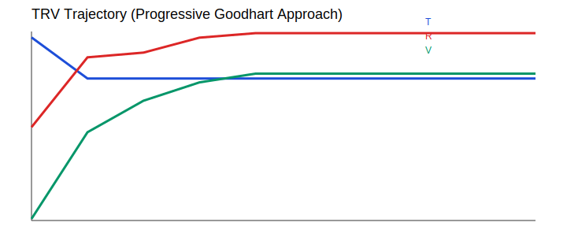
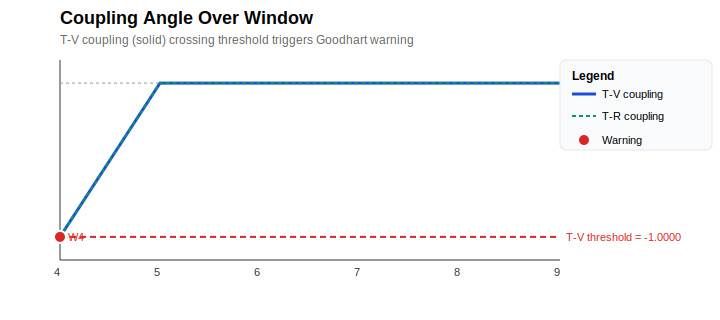

# Chatuskoti Evals


> **One-liner:** A benchmark-specific evaluation framework that decomposes research-loop decisions into three axes (Truthness, Reliability, Validity) and maps them to controller actions — so not every "metric up" gets the same merge decision.

## 1. The Problem

Standard evals ask "which system scored higher?" This repo asks: **"what should the loop do next?"**

In research loops (automated model search, agentic tooling, benchmark maintenance), a metric improvement often means the wrong thing to merge:

| Failure mode | What a metric-only gate sees | What actually happened |
|---|---|---|
| Pyrrhic gain | accuracy ↑ | run unstable, not reproducible |
| Metric-gamed | accuracy ↑ | exploited proxy/harness, not real progress |
| Incomparable | accuracy ↑ | eval regime changed, before/after invalid |
| Broken result | accuracy ↓ | damage, not just "no improvement" |

A binary gate collapses all four into "adopt" or "reject." **That's the bug this repo fixes.**

## 2. The Solution: Three Axes → Resolver Actions

`Chatuskoti Evals` decomposes every candidate run into three independent axes:

| Axis | Symbol | Question |
|---|---|---|
| Truthness | `T` | Did the anchored benchmark metric actually improve? |
| Reliability | `R` | Did the run stay stable and reproducible enough to trust? |
| Validity | `V` | Is the gain meaningful (not gamed, not regime-invalid)? |

These map to **five resolver actions** that a binary gate would collapse:

| Outcome type | Metric | T/R/V profile | Action | Why |
|---|---|---|---|---|
| Clean gain | ↑ | T+, R+, V+ | `adopt` | Better, stable, comparable |
| Pyrrhic gain | ↑ | T+, R−, V± | `hold` | Improvement not yet trustworthy |
| Metric-gamed | ↑ | T+, R±, V− | `reframe` | Loop learned wrong lesson |
| Broken result | ↓ | T−, R±, V± | `rollback` | This is damage |
| Incomparable | ↑ | T±, R±, V− (regime) | `reframe` | Comparison itself invalid |
| (no signal) | — | — | `keep_going` | Continue searching |

**Core claim:** not every positive metric delta is the same kind of outcome, so not every positive metric delta deserves the same control action.

## 3. Evidence (v1.3.0)

The strongest checked-in evidence is the **torch bundle** at `artifacts/strong_torch/` and **simulator bundle** at `artifacts/strong_simulator/`:

| Claim | Result |
|---|---|
| Canonical failure benchmark | **4/4** cases matched |
| Binary gate on same cases | would adopt **3/4** bad cases |
| Vec3 resolver routes them | `hold`, `reframe`, `rollback` correctly |
| Challenge comparison | binary reaches higher metric by taking merges benchmark says should **not merge** |
| Ablation proof | T-only: 0/4, any two axes: 2/4, full T/R/V: **4/4** |
| Coupling-angle lead time | **2-step lead** on simulator (`goodhart_descent` trajectory) |
| Thresholds | All thresholds are data-driven — `--tau auto` uses bottom-15th-percentile coupling, `--window auto` picks the variance-maximizing window size, resolver thresholds adapt to the observed population |

### Key Charts

**Ablation proof — all three axes necessary**  


**TRV trajectories & coupling angle (simulator — 2-step lead)**  
  


## 4. Getting Started

### Install

```bash
git clone https://github.com/your-org/chatuskoti-evals.git
cd chatuskoti-evals
python -m venv .venv
source .venv/bin/activate
pip install -e .
```

### Quickstart

```bash
# Verify environment
.venv/bin/python scripts/check_torch_env.py

# Run full torch evidence bundle (lead-time, annotations, ablations, trajectory-prediction)
bash scripts/run_torch_bundle.sh

# Run full simulator evidence bundle (lead-time, trajectory-prediction)
bash scripts/run_simulator_bundle.sh
```

### Individual Commands

```bash
# Lead-time analysis (simulator: fast validation)
.venv/bin/python -m chatuskoti_evals.cli lead-time \
  --backend simulator --iterations 10 --seeds 1 \
  --action stochastic_depth_high --window auto --tau auto \
  --output artifacts/strong_simulator/lead_time

# Lead-time analysis (torch: real ResNet-18/CIFAR-100)
.venv/bin/python -m chatuskoti_evals.cli lead-time \
  --backend torch --epochs 10 --seeds 3 --iterations 15 \
  --action stochastic_depth_high --window auto --tau auto \
  --cooldown 300 --output artifacts/strong_torch/lead_time

# Extract annotation cases (from a completed bundle)
.venv/bin/python -m chatuskoti_evals.cli extract-cases \
  --bundle artifacts/strong_torch \
  --output artifacts/strong_torch/annotation_cases.csv

# Ablation bundle
.venv/bin/python -m chatuskoti_evals.cli run-ablation \
  --backend torch --epochs 10 --seeds 3 --cooldown 30 \
  --output artifacts/strong_torch/ablations

# Trajectory prediction (simulator: endpoint vs trajectory-aware)
.venv/bin/python -m chatuskoti_evals.cli trajectory-prediction \
  --backend simulator --trajectories 500 --iterations 6 \
  --window 3 --ridge-alpha 1.0 --seeds 2 \
  --output artifacts/strong_simulator/trajectory_prediction

# Trajectory prediction (torch: real ResNet-18/CIFAR-100)
.venv/bin/python -m chatuskoti_evals.cli trajectory-prediction \
  --backend torch --trajectories 25 --iterations 4 \
  --window 3 --ridge-alpha 1.0 --seeds 1 \
  --cooldown 300 --cooldown-interval 2 \
  --output artifacts/strong_torch/trajectory_prediction
```

## 5. How to Read This Repo (Newcomer Order)

1. **Canonical failure benchmark** — `artifacts/strong_torch/lead_time/lead_time_analysis/summary.md`
2. **Annotation cases** — `artifacts/strong_torch/annotation_cases.csv`
3. **Ablation proof** — `artifacts/strong_torch/ablations/summary.md`
4. **Release/demo framing** — `docs/release_demo.md`

**Supporting docs:**
- Plain-language overview: `docs/why_four_states.md`
- Guided walkthrough: `docs/demo.md`
- Torch backend notes: `docs/real_backend.md`
- Open targets: `docs/release/next_steps.md`

## 6. Reference

### Repo Architecture (5 Layers)

| Layer | Files | Responsibility |
|---|---|---|
| **Benchmark & Backends** | `benchmark.py`, `torch_backend.py`, `scenarios.py` | Simulator + PyTorch (ResNet-18/CIFAR-100) execution, canonical failure cases |
| **Scoring & Decision** | `scoring.py`, `coupling.py`, `resolver.py`, `models.py` | T/R/V computation, sliding-window coupling detector, resolver actions, typed results |
| **Loop Orchestration** | `proposals.py`, `runner.py`, `wisdom.py` | Next-action proposals, comparison/ablation/calibration runners, offline memory |
| **Reporting & Release** | `reporting.py`, `cli.py`, `scripts/run_torch_bundle.sh`, `scripts/verify_release_bundle.py` | Markdown/JSON/SVG outputs, CLI entrypoint, end-to-end bundle gen + git staging |
| **Evidence & Docs** | `artifacts/`, `docs/` | Checked-in bundles, conceptual docs, release notes |

### Comparison vs Other Eval Styles

| Eval style | Typical question | What this repo adds |
|---|---|---|
| Pass/fail / leaderboard | "Which scored higher?" | Distinguishes kinds of higher score before control action |
| Regression tests | "Did we break something?" | Structured handling for unstable, gamed, incomparable wins |
| Safety / adversarial | "Can it fail dangerously?" | Focuses on benchmark-aware decision errors in the research loop |
| Process / trajectory | "What happened during run?" | Compresses trajectory → T/R/V axes + coupling-angle lead signal |

**Positioning:** Sits between a benchmark and a controller. Not just measurement — decision support.

### Scope & Limits

**This repo IS:**
- Benchmark-specific (CIFAR-100 + ResNet-18)
- Calibrated, evaluation-first, interpretable, reproducible

**This repo is NOT (yet):**
- Universal eval layer for all AI agents
- Proof Vec3 beats binary gates on every benchmark
- Learned/domain-general research controller
- Replacement for broader task suites
- Confirmed torch replication of simulator's 2-step coupling lead

## 7. Meta

### Version Status: 1.3.0
- Three-axis evaluator (T/R/V from trajectories)
- Resolver actions: `adopt`, `hold`, `reframe`, `rollback`, `keep_going`
- Canonical failure benchmark: 4/4 matched
- Coupling-angle detector (sign-product metric, 2-step simulator lead)
- Ablation framework (proves all 3 axes necessary)
- Dual backends: simulator + torch

### Planned 1.3.1
- Continuous coupling angle: `atan2(ΔV, ΔT)` + circular mean, warning on angle < −π/6 OR sign-coupling < −τ
- V guarantee: `eval_regime_changed` → V clamped ≤ −0.5

### Contributing
1. Open issue before significant changes
2. Run `python scripts/verify_release_bundle.py`
3. Keep changes benchmark-scoped (intentional narrowness)

### License
MIT — see [LICENSE](LICENSE)
